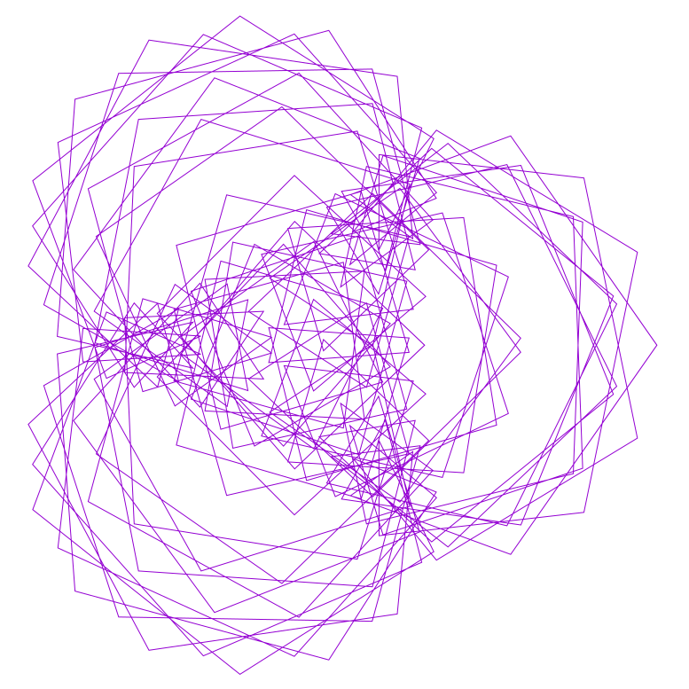
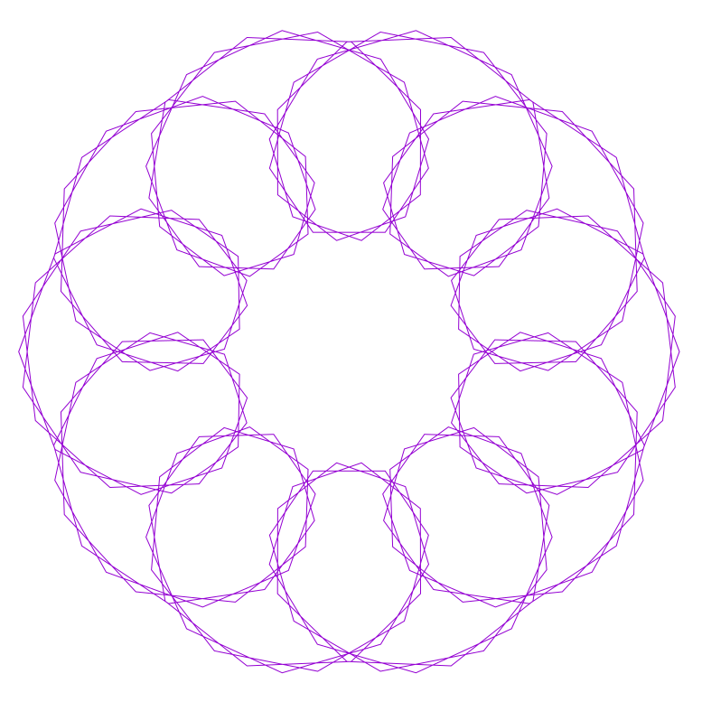

# Geometry calculator

Produces beautiful geometry

Only 5353 bytes in size!

```
maczito:fx-flower k$ du -ks . 
32	.

maczito:fx-flower k$ wc -c * 
     310 base.md
    1357 cx.sh
       0 im.log
     128 launch.sh
     488 preparecommands.sh
     522 runner.sh
    2276 samples.sh
     272 updatereadme.sh
    5353 total

maczito:fx-flower k$ ls -lha
total 64
drwxr-xr-x  11 k     wheel   352B 24 lip 23:43 .
drwxrwxrwt  14 root  wheel   448B 24 lip 23:42 ..
-rw-r--r--   1 k     wheel    44B 24 lip 23:43 .gitignore
-rw-r--r--   1 k     wheel   310B 24 lip 23:43 base.md
-rwxr-xr-x   1 k     wheel   1,3K 24 lip 23:43 cx.sh
-rw-r--r--   1 k     wheel     0B 24 lip 23:43 im.log
-rwxr-xr-x   1 k     wheel   128B 24 lip 23:43 launch.sh
-rwxr-xr-x   1 k     wheel   488B 24 lip 23:43 preparecommands.sh
-rwxr-xr-x   1 k     wheel   522B 24 lip 23:43 runner.sh
-rwxr-xr-x   1 k     wheel   2,2K 24 lip 23:43 samples.sh
-rwxr-xr-x   1 k     wheel   272B 24 lip 23:43 updatereadme.sh
```

## Requiremens:
```
brew install parallel gnuplot
```
## Usage

#### Generates entire set of 999^3 images

```
./preparecommands.sh `pwd`
./launch.sh
```

## For some nice samples press:

```
./samples.sh
open samples
```

### Links

https://linuxgazette.net/133/luana.html

## Samples

Values: Values: 144 360 144


Values: Values: 144 360 576


Values: Values: 144 360 720


Values: Values: 144 384 144


Values: Values: 144 384 384


Values: Values: 144 384 744


Values: Values: 144 408 144


Values: Values: 144 408 408


Values: Values: 144 408 672


Values: Values: 144 528 120



Values: Values: 231 1023 363


Values: Values: 231 1023 429


Values: Values: 231 1023 495


Values: Values: 231 1056 264


Values: Values: 231 1056 792


Values: Values: 231 1056 924


Values: Values: 231 1056 99


Values: Values: 231 297 528


Values: Values: 231 297 594


Values: Values: 231 330 330


Values: Values: 231 363 231


Values: Values: 231 363 495


Values: Values: 231 495 231


Values: Values: 231 528 231


Values: Values: 231 528 528


Values: Values: 231 561 561


Values: Values: 231 627 231


Values: Values: 231 726 231


Values: Values: 231 759 495


Values: Values: 231 759 759


Values: Values: 231 825 33


Values: Values: 231 825 528


Values: Values: 231 825 627


Values: Values: 231 858 1056


Values: Values: 231 858 198


Values: Values: 24 120 120


Values: Values: 24 120 216


Values: Values: 240 1008 600


Values: Values: 240 1008 624


Values: Values: 240 840 816


Values: Values: 240 864 240


Values: Values: 240 864 552


Values: Values: 240 888 240


Values: Values: 240 888 888


Values: Values: 264 165 1056


Values: Values: 264 24 24



Values: Values: 264 264 363


Values: Values: 264 264 561


Values: Values: 264 264 594


Values: Values: 264 264 627


Values: Values: 264 264 693


Values: Values: 264 264 726


Values: Values: 264 336 192


Values: Values: 264 72 72


Values: Values: 264 96 96


Values: Values: 264 99 759


Values: Values: 264 99 924


Values: Values: 33 1056 33


Values: Values: 33 198 198


Values: Values: 33 198 363


Values: Values: 33 198 759


Values: Values: 33 264 1056


Values: Values: 33 264 1089


Values: Values: 33 264 495


Values: Values: 33 330 627


Values: Values: 33 363 363


Values: Values: 33 528 495


Values: Values: 33 528 528


Values: Values: 33 561 1089


Values: Values: 33 627 33


Values: Values: 33 726 726


Values: Values: 33 726 825


Values: Values: 33 792 891


Values: Values: 33 825 231


Values: Values: 33 825 561


Values: Values: 33 924 132


Values: Values: 33 924 924


Values: Values: 480 648 816


Values: Values: 72 264 264


Values: Values: 72 264 72


Values: Values: 72 312 312


Values: Values: 72 312 792


Values: Values: 72 336 336


Values: Values: 72 336 72


Values: Values: 72 336 888


Values: Values: 72 360 360


